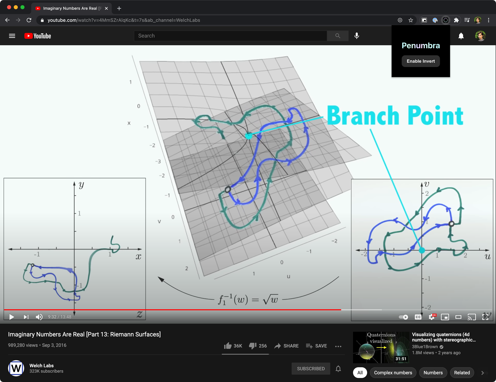
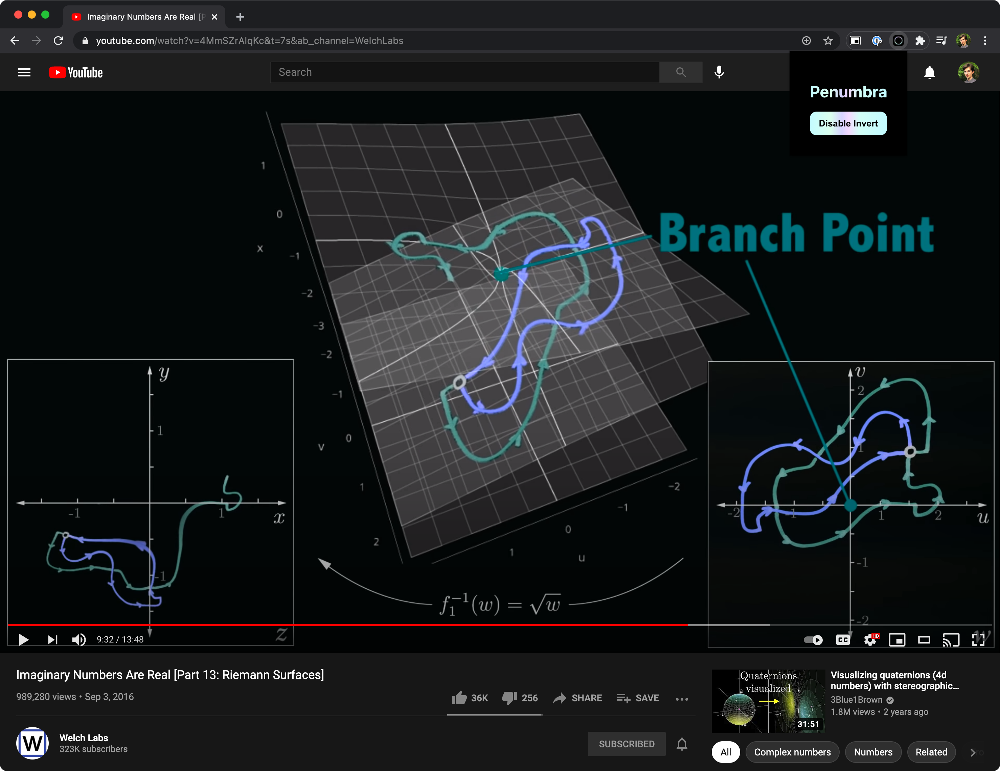

Our team made a Chrome extension in React that smart inverts videos in the browser for QWER Hacks 2021. 

## Inspiration
We were inspired by technologies that change color rendering to ease eye strain.

## What it does
Penumbra is a chrome extension that inverts bright colors of videos in the browser, allowing users to play videos in "dark mode" while preserving the color scheme of the rest of the browser.

Lecture without Penumbra color inverter.

Lecture video with Penumbra color inverter. Note: color hues are maintained.
## How we built it
Penumbra was built as a chrome extension, and uses React to modify webpage elements.

## Accomplishments that we're proud of
Penumbra successfully inverts the colors of videos, including those which are live streamed.  Our "smart inversion" tool preserves color hues, and maintains desired aesthetics of the original video better than some other color inversion technologies.

## What we learned
We all learned how to build a chrome extension for the first time.  For some of our team members, it was our first experience using react and figma.

## What's next for Penumbra
We are considering functionality that would prevent Penumbra from inverting videos that are already recorded with a dark color scheme.  At the moment, the user needs to manually toggle inverter.  We also plan to publish Penumbra to the chrome web store, so that other students may use it.

# Getting Setup

## Download a release

You can [download a release here](https://github.com/vincentspitale/Penumbra/releases) then:

* Unzip the compressed directory
* Go to `chrome://extensions/`
* Ensure `Developer Mode` is enabled
* Click `load unpacked`
* Select the unzipped folder
* Enjoy!

## Contributing to the source

### Install Dependencies 
In the project directory, you must first run:

### `yarn install`
Downloads all of Penumbra's dependencies.
### Available Commands

### `yarn start`

Runs the extension in the development mode.\
Open [http://localhost:3000](http://localhost:3000) to view it in the browser.

The page will reload if you make edits.\
You will also see any lint errors in the console.

### `yarn test`

Launches the test runner in the interactive watch mode.\
See the section about [running tests](https://facebook.github.io/create-react-app/docs/running-tests) for more information.

### `yarn build` or `npm run build`

Builds the app for production to the `build` folder.\
It correctly bundles React in production mode and optimizes the build for the best performance.

The build is minified and the filenames include the hashes.\
Your app is ready to be deployed!

See the section about [deployment](https://facebook.github.io/create-react-app/docs/deployment) for more information.

## Learn More

You can learn more in the [Create React App documentation](https://facebook.github.io/create-react-app/docs/getting-started).

To learn React, check out the [React documentation](https://reactjs.org/).

### Code Splitting

This section has moved here: [https://facebook.github.io/create-react-app/docs/code-splitting](https://facebook.github.io/create-react-app/docs/code-splitting)

### Analyzing the Bundle Size

This section has moved here: [https://facebook.github.io/create-react-app/docs/analyzing-the-bundle-size](https://facebook.github.io/create-react-app/docs/analyzing-the-bundle-size)

### Making a Progressive Web App

This section has moved here: [https://facebook.github.io/create-react-app/docs/making-a-progressive-web-app](https://facebook.github.io/create-react-app/docs/making-a-progressive-web-app)

### Advanced Configuration

This section has moved here: [https://facebook.github.io/create-react-app/docs/advanced-configuration](https://facebook.github.io/create-react-app/docs/advanced-configuration)

### Deployment

This section has moved here: [https://facebook.github.io/create-react-app/docs/deployment](https://facebook.github.io/create-react-app/docs/deployment)

### `yarn build` fails to minify

This section has moved here: [https://facebook.github.io/create-react-app/docs/troubleshooting#npm-run-build-fails-to-minify](https://facebook.github.io/create-react-app/docs/troubleshooting#npm-run-build-fails-to-minify)
